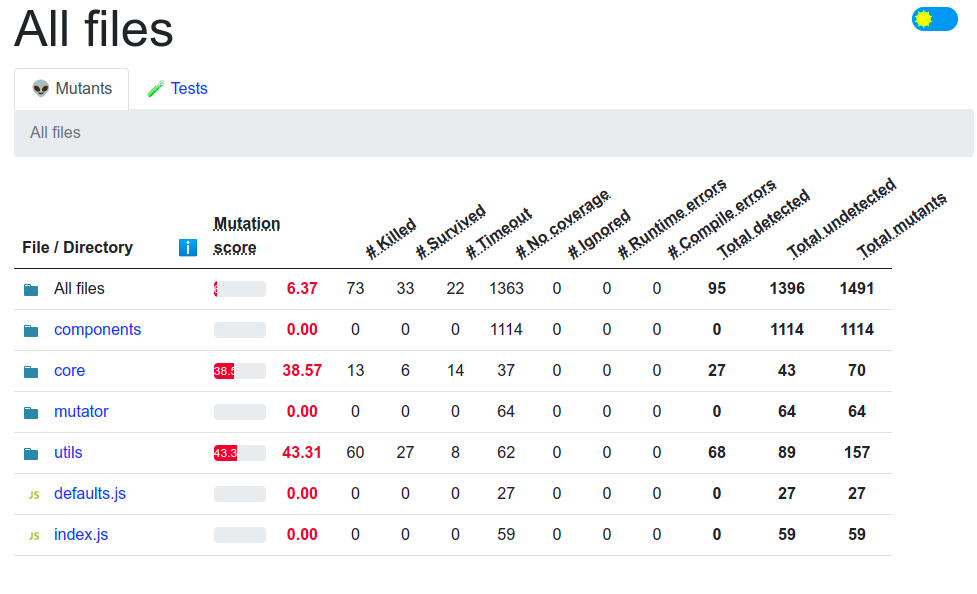

Now that we installed Stryker and learnt how to change the config file we can finally run the program to do this we need to run the following command:
 
   stryker run
 
After you execute this command you will start to see messages appearing on the terminal. This includes how many files will be scanned if stryker detects a bug and when the mutation actually starts you will be seeing the test being run. This should last about 2 minutes.
 
After the run is finished we will need to refresh <strong>VSCODE</strong> and inside we will find the following route <strong>reports/mutation/html/index.html </strong>. If you want to see this in your own browser you left click the file in Vscode and download it.
 
When you open the file, you will be greeted with the following display:
 

 
Here you get an average score of how you performed in respect to the amount of mutants that got discovered. You also get a number of the amount of blocks of code that didn't get covered by the tests. To see exactly what lines are the ones that aren't being correctly covered you can click inside the file. This will be discussed in depth on the next step.
 
### *Note: The test look poor because we had to delete most in order for it to run in an appropriate amount of time