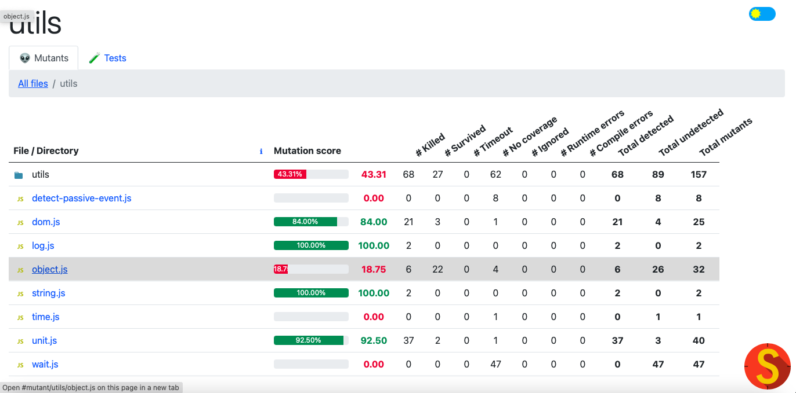
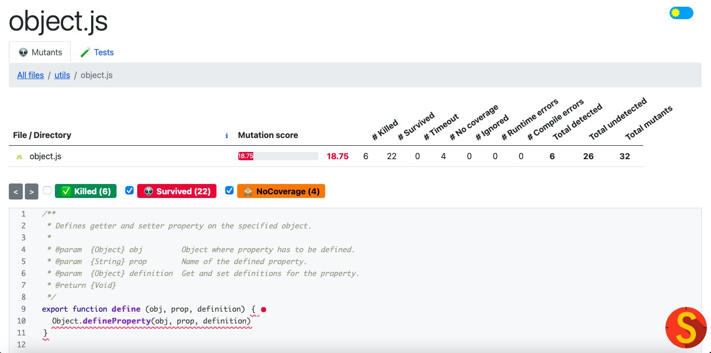
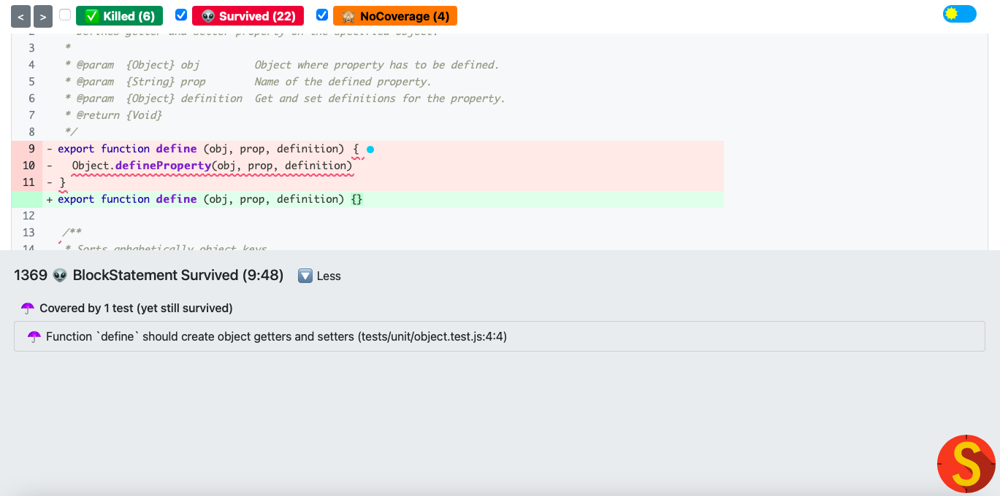

After seeing the statistics for how well your tests performed on the generated mutants you might want to see what exact mutants were killed and which survived.

To demonstrate how to do this, we will take a closer look at the reports of one file in the utils folder: object.js

Click on the utils folder and it should take you to a page that looks like this:

This shows in depth statistics of the mustants based on the specific files within the folder. If you need clarification about the mutant states and metrics, see this <a href="https://stryker-mutator.io/docs/mutation-testing-elements/mutant-states-and-metrics">page</a>.

Now suppose we want to take a look at the object.js file because the mutation score is only 18.75%. To see what mutations were run line by line, click on the specified file, so in this case click on ‘object.js’.

When you click on ‘object.js’ it should take you to a page that looks like this:

At the top you can see the metrics for the mutants for the specified file. You can also toggle between ‘killed’, ‘survived’, and ‘No Coverage’ by clicking the corresponding check box. Based on your selections it will display the correct mutants that were run. 

Mutants are displayed as little colored circles like the one seen on line 9. Green circles are killed mutants, red are mutants that survived, and orange are the ones that were not covered by tests. To look at exactly what type of mutant was tested click on the circle. This will bring up more information about the mutant. If you click on the one on line 9 and the ‘more’ button it should display this:

Here it shows ‘BlockStatement Survived’ and that it was covered by 1 test, but the mutant still survived. This specific mutant is created by removing the code within the block and seeing how your tests deal with it. To understand the types of supported mutants, see this <a href="https://stryker-mutator.io/docs/mutation-testing-elements/supported-mutators">page</a>.

It also shows what test was run that covered the specific line. In this case it was the “Function ‘define’ should create object getters and setters” in the tests/unit/object.test.js file.

Based on what mutants you want to be run, you can specify exactly what you want and don’t want to test in the config file you should have already created.
